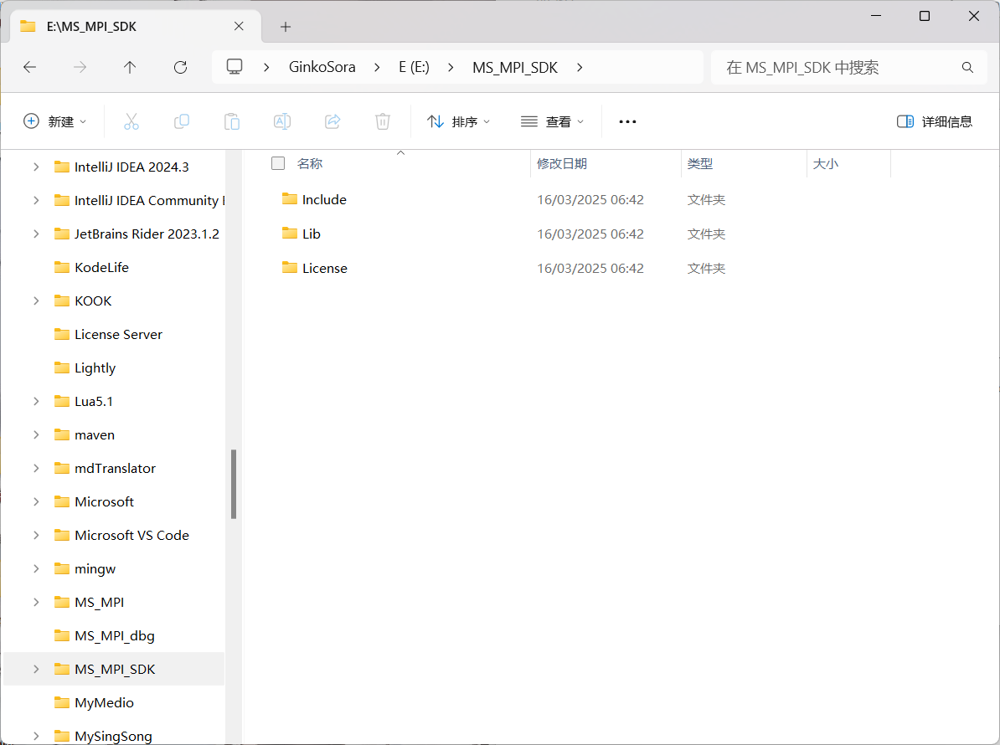
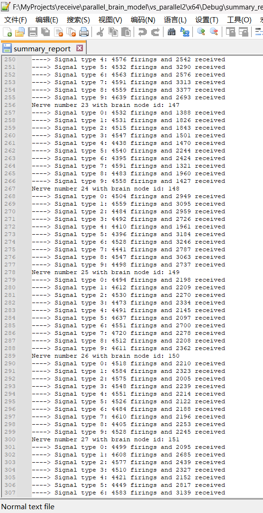

# Parallel computing of a brain model simulation

this is a visual stuido c project using visual studio version 2022.

### build

To build the project, open `vs_parallel.sln` file with visual studio.

### dependencies

You also have to download MS MPI from microsoft:

[Download Microsoft MPI v10.1.3 from Official Microsoft Download Center](https://www.microsoft.com/en-us/download/details.aspx?id=105289)

you'd better install the SDK under E:\MS_MPI_SDK folder like following picture:

otherwise, you have to change the include directories and lib directories that stored in the project, if you want to build the project by yourself.

### executable file

the executable file is generated under folder ./x64/Debug

to run it

> mpiexec -n 4 ./vs_parallel.exe ./small 100

and generate the report file "summary_report"

the report file has such a view

### src file

- global.h

> header includes, declares of macros, variables and functions.

- global.c

> initialization of variables and defination of functions. 

- main.c

> main function to complete the simualtion process.

- test.c

> test some MPI function and some other features.

start reading code with "main.c", and check the defination of functions

